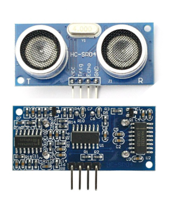

## HC-SR04
Sensor that will allow me to measure the level.

### Hardware Description
- Supply voltage: 5 Vdc.
- Working frequency: 40 KHz.
- Maximum range: 4.5 m.
- Minimum range: 2.0 cm.
- Minimum trigger pulse duration (TTL level): 10 μS.
- Output echo pulse duration (TTL level): 100-25000 μS.
- Minimum waiting time between a measurement and the start of another 20 mS.
- Opening angle: 15º.

